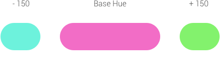
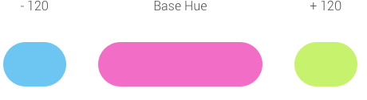
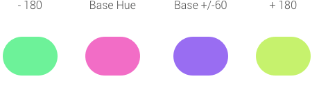

# Color wheel
The color wheel or color circle is the basic tool for combining colors. The first circular color diagram was designed by Sir Isaac Newton in 1666.

The color wheel is designed so that virtually any colors you pick from it will look good together. Over the years, many variations of the basic design have been made, but the most common version is a wheel of 12 colors based on the RYB (or artistic) color model.

Traditionally, there are a number of color combinations that are considered especially pleasing. These are called color harmonies or color chords and they consist of two or more colors with a fixed relation in the color wheel.

## Complementary
Complementary schemes are created by combining colors from opposite sides of the color wheel.
Colors are **180 degrees** separated in the color wheel.

## Analogous
Analogous color schemes are the next easiest to create. Analogous schemes are created by using three colors that are next to each other on the 12-spoke color wheel.
Colors are **30 degrees** separated in the color wheel in each direction.

## Split Complementary
Split complementary schemes use colors that are on either side of the hue opposite your base hue.
Colors are **150 degrees** separated in the color wheel in each direction.

## Triadic
Triadic schemes are made up of hues equally spaced around the 12-spoke color wheel.
Colors are **120 degrees** separated in the color wheel in each direction.

## Tetradic Rectangle
Four colors arranged into two complementary color pairs.
A set of complimentary colors plus their **60 degrees** separated in the color wheel.

## Tetradic Square
Four colors arranged into two complementary color pairs.
A set of complimentary colors plus their **90 degrees** separated in the color wheel.

## Source
[Basic color schemes - Introduction to Color Theory](http://www.tigercolor.com/color-lab/color-theory/color-theory-intro.htm)
